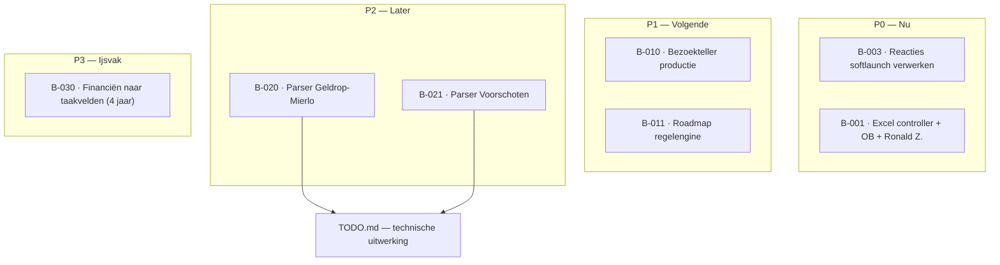

# Backlog — BeleidsBibliotheek Wassenaar (en verwante tooling)

Samen te vullen en te schonen. **Geen** vervanging van de mutatieketen in `docs/` of `data.js`; dit is het **plannings- en prioriteitsoverzicht**.

**HTML-weergave (diagram + tabellen):** [`docs/backlog.html`](docs/backlog.html) — lokaal openen in de browser (internet nodig voor Mermaid-CDN) of via een lokale server.

| Legenda | Betekenis |
|--------|-----------|
| **P0** | Nu / blokkerend / afgesproken deadline |
| **P1** | Volgende: hoog gewenst |
| **P2** | Later / wanneer tijd |
| **P3** | Idee / ijsvak — nog niet ingepland |

| Status | Betekenis |
|--------|-----------|
| `idea` | Nog niet klaar om op te pakken |
| `ready` | Beschrijving en bron helder genoeg |
| `doing` | In uitvoering |
| `done` | Afgerond (datum in notitie of mutatierapport) |

### Grafische weergave (Mermaid)

Onderstaand diagram **spiegelt** de backlog-onderdelen hieronder. Bij wijzigingen: eerst de tabellen aanpassen, daarna dit blok synchroon houden.

**Waar zie je het als plaatje?** O.a. **GitHub** (rendering van Mermaid), **Cursor** (Markdown Preview), VS Code met Mermaid-extensie, of plak het blok op [mermaid.live](https://mermaid.live) voor een export (PNG/SVG).

*(Pijlen naar `TODO.md`: B-020/B-021 zijn in de backlog samengevat; uitwerking staat in de technische takenlijst.)*

---

## P0 — Nu

| ID | Item | Status | Notities / link |
|----|------|--------|-------------------|
| B-002 | **Mobiel menu:** link naar overdrachtsdossier ontbreekt op mobiel (hamburger-menu) | `done` | `2026-04-17`: Oorzaak: hamburger-knop stond op `top: 50%` en bedekte bij open menu het 2e nav-item. Fix: `styles.css` — bij `.nav-open` hamburger naar `top: 0.5rem` i.p.v. verticaal centreren. |
| B-003 | **Reacties softlaunch verwerken** (8 apr + 13 apr 2026) — 8 feedbackmails + 2 FW-mails | `ready` | `_reacties/` — 3× "Hoort hier niet" (H1 Veiligheid), 1× "Hoort hier niet" (H2 → 2.4), 2× "Link klopt niet" (H0 Fin. beheer + H3 → 3.1), 1× "Overig" (H2 → 2.2 Parkeren), 1× "Link klopt niet" (H7 → 7.4 Milieubeheer, Jacqueline, 13 apr). Verwerken in `app.js` / `data.js`. |
| B-001 | **Excel controller + OB-verwijzingen** verwerken samen met **feedback Ronald Zoutendijk** | `ready` | [`docs/NOTITIE_opvolging_excel_controller_Ronald_Z.md`](docs/NOTITIE_opvolging_excel_controller_Ronald_Z.md) — inventaris → BBV-koppeling → mutatieketen |

---

## P1 — Volgende

| ID | Item | Status | Notities / link |
|----|------|--------|-------------------|
| B-010 | Bezoekteller **stats/** op productie stabiel (rechten, spotcheck footer) | `idea` | `wassenaar/stats/ping.php`, `wassenaar/stats/README.txt` |
| B-011 | Interne roadmap **regelengine / ruimtelijke lagen** vervolg (indien gewenst) | `idea` | `wassenaar/roadmap-regelengine.html` |

---

## P2 — Later

| ID | Item | Status | Notities / link |
|----|------|--------|-------------------|
| B-020 | **Besluit-Wijzer:** zelfde parser/display-aanpassing als Wassenaar voor **Geldrop-Mierlo** | `ready` | Zie [`TODO.md`](TODO.md) |
| B-021 | **Besluit-Wijzer:** idem voor **Voorschoten** | `ready` | Zie [`TODO.md`](TODO.md) |

---

## Technische taken (detail)

Dieper technisch werk blijft in **`TODO.md`** staan; in deze backlog alleen **één regel** met link (B-020/B-021).

---

## P3 — Ijsvak / ideeën

| ID | Item | Status | Notities / link |
|----|------|--------|-------------------|
| B-030 | **Financiën naar taakvelden** — 4 jaar begrotings-/jaarrekeningdata (2022–2025) per BBV-taakveld zichtbaar maken | `idea` | Mega-doorontwikkeling (weken). Iv3-informatievoorschrift aanwezig (`Iv3-informatievoorschrift-gemeenten-en-gr-en-2026-1-0.pdf`), `taakvelden_iv3.js` bestaat, CBS-data `85755NED` (JSON/CSV) aanwezig. Scope: databronnen koppelen, UI ontwerpen (grafieken/tabellen), integratie in tegel-structuur. |

---

## Changelog backlog

| Datum | Wijziging |
|-------|-----------|
| 2026-04-17 | B-002 afgerond (hamburger overlap mobiel menu, `styles.css`). |
| 2026-04-13 | B-002 (mobiel menu), B-003 (reacties softlaunch), B-030 (financiën taakvelden) toegevoegd. Mermaid-diagram bijgewerkt. |
| *(eerder)* | Eerste versie aangemaakt; B-001 t/m B-021 ingevuld vanuit bestaande notities en TODO. |
